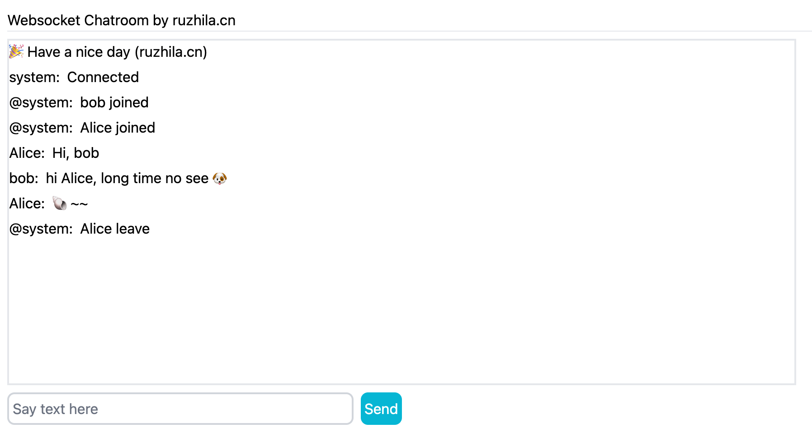
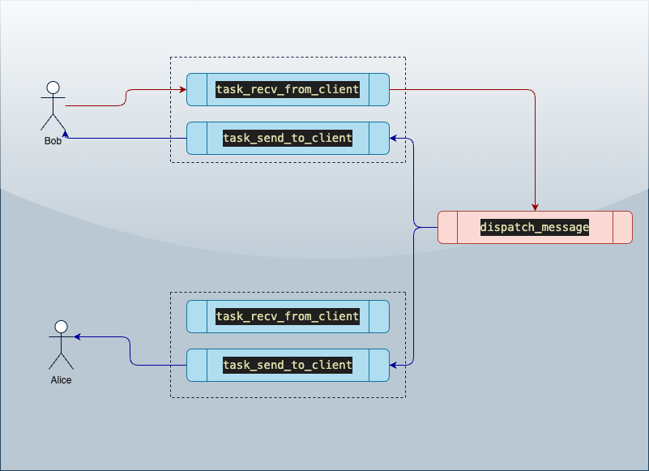

# A FastAPI chatroom, 100 lines of python code

By [ruzhila.cn](http://ruzhila.cn/?from=github_fastapi_chatroom), a campus for learning backend development through practice.

This is a tutorial code demonstrating how to use Python write chatroom. Pull requests are welcome. 👏

## Usage
```bash
python3 -m venv venv
# switch to venv
. venv/bin/activate
pip install -r requirements.txt

python3 app.py

```
## Screenshot


## Workflow
